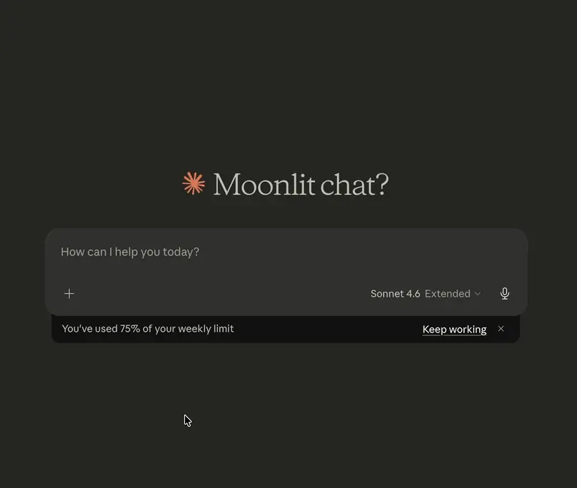
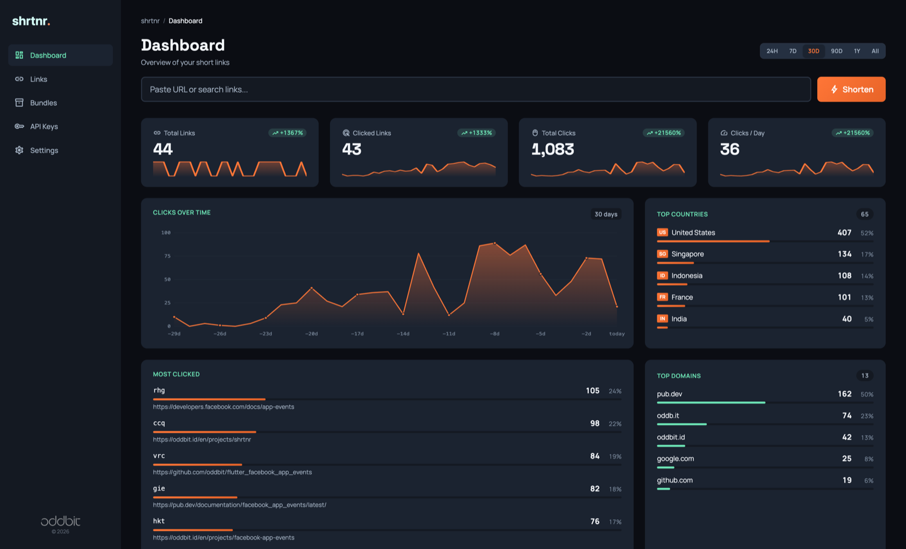
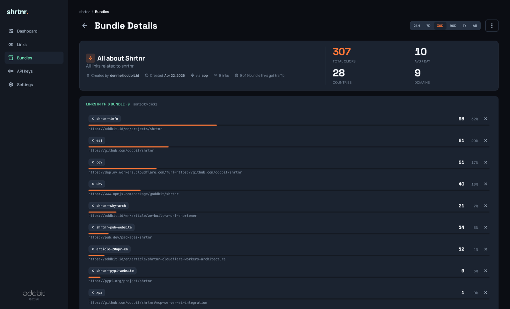
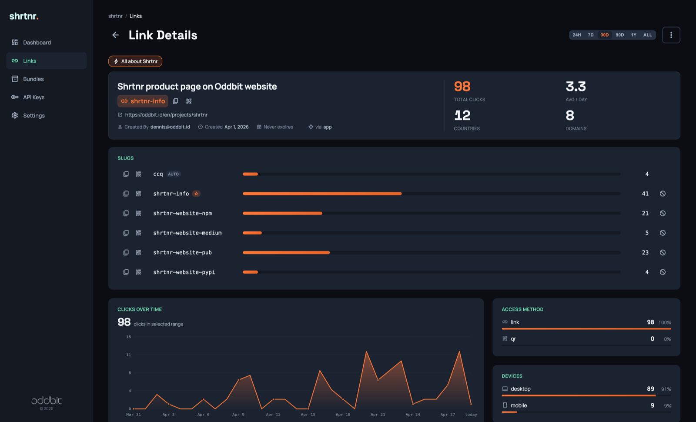
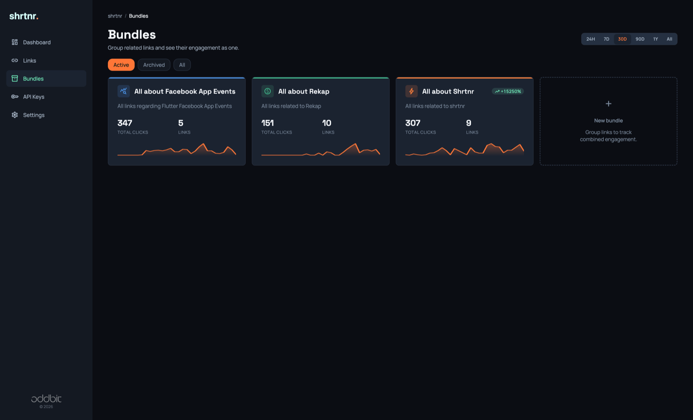
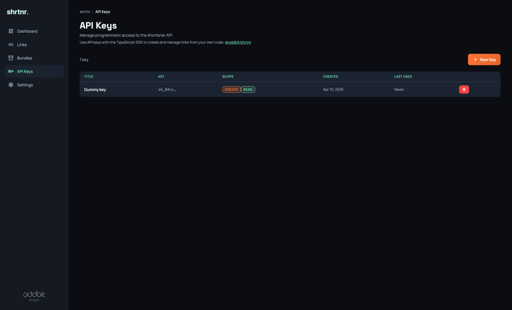

# A programmable link layer for apps, teams and AI agents

[](https://www.npmjs.com/package/@oddbit/shrtnr)
[](https://pypi.org/project/shrtnr/)
[](https://pub.dev/packages/shrtnr)

shrtnr is a self-hosted URL shortener you drive from code and from AI assistants, not only from a dashboard. Every deployment ships a REST API with an OpenAPI spec, typed SDKs on npm, PyPI and pub.dev, and a native MCP server that Claude, Copilot and any other MCP client connect to through OAuth on Cloudflare Access. Links belong to the person who created them, several slugs can point at one destination, and bundles roll the clicks of a whole campaign into one report. It runs on Cloudflare Workers and D1, inside the free tier.

[](https://oddb.it/shrtnr-deploy-top)



## Who this is for

- **Teams that need per-person permissions, not a shared password.** Sign-in runs through Cloudflare Access, so every teammate arrives with their own identity. Links and bundles record who created them, and only the creator can edit, disable or delete them. Everyone can read everything. API keys are issued per person and act as that person. [Permission model](docs/access-control.md#permission-model).
- **Developers integrating links into an app.** A REST API documented by an OpenAPI 3.1 spec, with a live reference at `/_/api/docs` on your deployment. Typed SDKs for TypeScript, Python and Dart, generated from that spec. Bearer keys with `read` and `create` scopes. Link creation is idempotent, and QR codes come back as SVG from one endpoint.
- **Anyone whose AI assistant should create and manage links.** The MCP server at `mcp.<your-domain>` exposes tools to shorten URLs, attach slugs, group links into bundles and query analytics, annotated as read-only, idempotent or destructive. It authenticates through OAuth on Cloudflare Access, so there is no shared token to paste into a config file. [MCP server](docs/mcp.md).

## Features

What sets it apart:

- **Native MCP server.** Tools for links, slugs, bundles, QR codes and analytics, served from the same Worker. OAuth through Cloudflare Access Managed OAuth; every tool call runs as the signed-in user. Analytics tools echo the time range they used and apply the user's own bot and self-referrer filters. [Setup and tool reference](docs/mcp.md).
- **Bundles with combined analytics.** Group the links of one campaign, launch or project. A bundle reports total clicks, a timeline, countries, referrers, devices, browsers and each link's share of the total, over any time range. A link can belong to several bundles. Archive a bundle when the campaign ends.
- **Several slugs per link.** One destination can answer on a random slug and any number of custom slugs, for example one per channel. Each slug tracks its own clicks. Disable or enable a slug on its own, or pick which one is primary.
- **Ownership and permissions.** Identity comes from Cloudflare Access. Creators own their links and bundles; anyone can read, and anyone can add a slug to a link or a link to a bundle. Settings such as theme, language and default range are stored per user. [Access control](docs/access-control.md).
- **Typed SDKs** for TypeScript ([`@oddbit/shrtnr`](https://www.npmjs.com/package/@oddbit/shrtnr)), Python ([`shrtnr`](https://pypi.org/project/shrtnr/)) and Dart/Flutter ([`shrtnr`](https://pub.dev/packages/shrtnr)). CI pins each SDK to the hash of the OpenAPI spec it was generated from, so an API change cannot ship without the SDKs moving with it.
- **REST API** with an OpenAPI 3.1 spec at `/_/api/openapi.json` and an interactive reference at `/_/api/docs`. API keys are hashed at rest and scoped to `read`, `create` or both.

The rest of the shortener:

- **Click analytics** by country, referrer URL and referrer host, device type, operating system, browser, and QR scan versus link click, with a timeline that adapts its buckets to the range (24 hours to all time). Bots and self-referrers are filtered out by default, per user.
- **Custom slugs and short random slugs.** Random slugs start at 3 characters from a 32-character alphabet, which gives 32,768 combinations at that length. Custom slugs like `/spring-sale` sit alongside them.
- **Link expiry.** Set `expires_at` on creation or later; an expired link answers 404.
- **Disable instead of delete.** A link or slug with recorded clicks cannot be deleted, only disabled, so click history is never lost by accident. Disabling is reversible.
- **Idempotent creation.** Shortening a URL that already has a link returns the existing link, after trailing-slash normalization. Pass `allow_duplicate` to force a second one.
- **Labels from the page title.** A link created without a label gets the destination page's title fetched in the background, with private and internal hosts refused.
- **QR codes** as SVG for any slug, from the admin UI, the API, the SDKs and MCP. Scans are tracked separately from link clicks.
- **Edge redirects.** Slug lookups are cached in Workers KV in front of D1, and click recording runs after the redirect is sent.
- **Admin dashboard** in English, Indonesian and Swedish, with three themes, per-link and per-bundle analytics, API key management and settings.
- **Browser extension** for Chrome and Firefox that shortens the current tab against your own deployment. Source and store status in [browser-extensions/README.md](browser-extensions/README.md).
- **One-click deploy** with automatic provisioning of the database and KV namespace, and migrations that the Worker applies on its first request.

Not yet: password-protected links, link import and export, routing by device or country, tags, social preview overrides, click webhooks, and a read-only MCP scope. UTM parameters are stored on every click but not yet reported in the dashboard.

## Screenshots

| Dashboard | Bundle analytics | Link analytics |
|---|---|---|
|  |  |  |

| Bundles | API keys |
|---|---|
|  |  |

<p align="right"><a href="https://oddb.it/shrtnr-info">See it in action</a></p>

## Deploy

### One-click

Click the **Deploy to Cloudflare** button. Cloudflare forks the repo into your GitHub or GitLab account, provisions the D1 database and KV namespace that `wrangler.jsonc` declares, and deploys the Worker through [Workers Builds](https://developers.cloudflare.com/workers/ci-cd/builds/).

[](https://oddb.it/shrtnr-deploy-howto)

The Worker creates its own database schema on the first request, so there is no command to run afterwards. To confirm the deploy:

1. Open `https://<your-worker>.workers.dev/_/admin/dashboard` and create a link. That first visit creates the schema.
2. Open `https://<your-worker>.workers.dev/_/health`. It answers `"schema": { "ready": true }`.
3. Protect the admin pages before you share the domain: see [Protect the admin UI](#protect-the-admin-ui).

Every later push to your fork redeploys through Workers Builds, and the Worker applies any new migration on the first request after the deploy. See [Database schema](#database-schema) for how that works and what to check when it does not.

### Manual

```bash
git clone https://github.com/oddbit/shrtnr
cd shrtnr
yarn install
yarn wrangler-login
yarn deploy
```

`wrangler.jsonc` declares the D1 database and KV namespace by name only. The first `yarn deploy` creates both in your account through wrangler's [resource provisioning](https://developers.cloudflare.com/workers/wrangler/configuration/#automatic-resource-provisioning) and later deploys link to them by binding name. Wrangler also writes the new IDs into `wrangler.jsonc` on your machine; discard that change, the IDs are specific to your account and the deploy works without them.

The first request creates the schema. To apply it ahead of that request from your terminal, run `yarn db:migrate:remote`; the Worker and the CLI record their work in the same table, so either can go first.

### Continuous deployment

Cloudflare [Workers Builds](https://developers.cloudflare.com/workers/ci-cd/builds/) redeploys the Worker on every push to your production branch. Schema changes need no separate step: the deployed Worker carries its migrations and applies the pending ones on the first request.

The build settings the project expects, under **Workers & Pages > shrtnr > Settings > Build** in the dashboard:

| Field | Value |
|---|---|
| Build command | empty |
| Deploy command | `yarn deploy` (or `npx wrangler deploy`) |
| Version command | `npx wrangler versions upload` |

A fork created by the deploy button gets these from `package.json`. Both commands work with the bindings declared by name in `wrangler.jsonc`: wrangler links to the Worker's existing KV namespace and D1 database by binding name. A project set up before this repo dropped its id placeholders may still carry `bash scripts/resolve-bindings.sh && ...` in one of these fields; that script no longer exists, so remove that prefix or the build fails with "No such file or directory".

Two optional ways to apply migrations before the Worker takes traffic, for deployments that want the schema in place ahead of the first request:

- **GitHub Actions.** `.github/workflows/migrate.yml` runs `wrangler d1 migrations apply` after Cloudflare's check suite succeeds on `main`. It needs two repository secrets under **Settings > Secrets and variables > Actions**: `CLOUDFLARE_API_TOKEN` with **Workers Scripts: Edit** and **D1: Edit**, and `CLOUDFLARE_ACCOUNT_ID`. A fork created by the deploy button can add the workflow and the secrets the same way.
- **Workers Builds deploy command.** Set the project's deploy command to `npx wrangler d1 migrations apply DB --remote && npx wrangler deploy`. The token Workers Builds creates for itself holds Workers Scripts, KV and R2 edit rights; [its documented permission list](https://developers.cloudflare.com/workers/ci-cd/builds/configuration/) does not include D1, so add **D1: Edit** to that token under **My Profile > API Tokens** first, or the migration step fails with an authentication error.

### Database schema

Migrations live in `migrations/*.sql`. `yarn migrations:bundle` (run for you by `yarn dev`) writes them into `src/db/migrations.generated.ts`, which ships inside the Worker; the vitest suite fails when the two disagree, so add a migration, run the bundler, and commit both.

On the first request an isolate receives, the Worker applies every migration that is not yet recorded in D1's `d1_migrations` table, the same table with the same file names that `wrangler d1 migrations apply` uses. Each migration runs as one transaction with its bookkeeping row, so a race between isolates on a fresh deploy ends with each migration applied once. After that first request the check is a settled promise, and a fresh isolate reads the recorded schema version from KV before it touches D1, so redirects pay nothing for it.

Two routes report on the schema, and neither changes it on a GET:

- `GET /_/health` includes `schema.version` (what this build expects), `schema.applied` (the last recorded migration) and `schema.ready`. A database no request has reached yet reports `ready: false` with 200. After a failed migration attempt it answers 503 with `"status": "degraded"` and the error.
- `GET /_/setup` lists applied and pending migrations. `POST /_/setup` retries the migration at once. Both require a Cloudflare Access identity once `ACCESS_AUD` is set, and are rate-limited to ten requests a minute per client before that.

When a migration fails, the Worker remembers the failure for 30 seconds before a request triggers another attempt, so a migration that fails against live data costs one failed statement batch per half minute, not one per request. What visitors see depends on the database:

- **No schema yet** (a fresh deploy): every route answers a 503 page that names the failing migration and the database error. The usual cause is a Worker without a D1 binding named `DB` (check **Settings > Bindings** in the dashboard).
- **An older schema in place** (an upgrade whose new migration fails): short links keep redirecting, since they read tables that already exist. The admin pages, the API and the MCP endpoint answer the 503 page instead, and `/_/health` reports degraded, so the operator sees the failure and visitors do not.

## Protect the admin UI

The admin pages ship without built-in authentication. Put [Cloudflare Access](https://developers.cloudflare.com/cloudflare-one/applications/) in front of `/_/admin/*`: one self-hosted application, one allow policy for your email domain, and any login method from Google and GitHub to SAML or a one-time PIN. Access also supplies the per-user identity that ownership, API keys and settings run on. For defense in depth, store the application's AUD tag as the `ACCESS_AUD` secret and the Worker verifies every JWT itself. Step-by-step instructions, the identity table and the full permission model are in [docs/access-control.md](docs/access-control.md).

## MCP server

Point Claude, Copilot or any other MCP client at `https://mcp.<your-domain>` and sign in through Cloudflare Access when the browser opens. The endpoint needs its own subdomain and a second Access application with Managed OAuth turned on, plus the `MCP_ACCESS_AUD` secret. The one setting that catches people out is Cloudflare's "Block AI bots" rule, which has to be off for the zone. The setup walkthrough, client configuration snippets and the tool reference are in [docs/mcp.md](docs/mcp.md).

## API

Authentication is determined by route prefix:

| Route | Auth | Notes |
|---|---|---|
| `/_/api/*` | Bearer token | Public link-management API. Create keys from the admin UI under **API Keys** and pass them as `Authorization: Bearer sk_...`. |
| `/_/mcp` (and `mcp.<your-domain>`) | OAuth | MCP endpoint for AI assistants. Auth handled by Cloudflare Access. See [MCP server](docs/mcp.md). |
| `/_/admin/*` | None built in | Admin UI and admin-only API. Protect externally (see [Protect the admin UI](#protect-the-admin-ui)). Not callable with API keys. |
| `/_/health` | Public | Health check. |

For full endpoint shapes, parameters, and example payloads, see the live API reference at **`/_/api/docs`** on your deployment, or fetch the OpenAPI 3.1 spec directly at **`/_/api/openapi.json`**. The spec is the source of truth: SDKs ([TypeScript](sdk/typescript/README.md), [Python](sdk/python/README.md), [Dart](sdk/dart/README.md)) regenerate from it when the API changes.

## SDKs

Shorten URLs, manage slugs and bundles, and read analytics from your own code. All three expose the same resource groups: `links`, `slugs` and `bundles`.

- TypeScript/JavaScript: [`@oddbit/shrtnr`](https://www.npmjs.com/package/@oddbit/shrtnr) on npm. Details in [sdk/typescript/README.md](sdk/typescript/README.md).
- Python: [`shrtnr`](https://pypi.org/project/shrtnr/) on PyPI. Sync and async clients on httpx. Details in [sdk/python/README.md](sdk/python/README.md).
- Dart/Flutter: [`shrtnr`](https://pub.dev/packages/shrtnr) on pub.dev. Details in [sdk/dart/README.md](sdk/dart/README.md).

## Development

```bash
yarn install
yarn types                       # binding and runtime types from wrangler.jsonc, git-ignored
cp .dev.vars.example .dev.vars   # local identity settings, git-ignored
yarn test
yarn dev
```

`yarn types` writes `worker-configuration.d.ts`, which the typecheck needs. Rerun it after changing `wrangler.jsonc`. `yarn dev` creates the local D1 database and KV namespace on start and the schema on the first request; `yarn db:migrate:local` applies the schema from the CLI instead.

### Local sign-in

Cloudflare Access protects the admin pages in production. `wrangler dev` runs without it, and the admin pages still need an identity: writes are owner-gated and settings are stored per user. Pick one per browser:

```
http://localhost:8787/_/dev/login?as=you@example.com
```

This sets a `dev_identity` cookie for that browser only, so a second browser or a second Playwright context can act as a second owner. `/_/dev/login` without `as` shows a form; `/_/dev/logout` clears the cookie. Requests carrying no cookie fall back to `DEV_IDENTITY` from `.dev.vars`. Both routes answer 404 whenever `ACCESS_AUD` is set, so a deployment exposes nothing.

### SDK development

```bash
cd sdk
yarn install
yarn test
yarn build
```

See [CONTRIBUTING.md](CONTRIBUTING.md) for the test suites, the SDK parity rule and what a pull request needs.

## Built by Oddbit

shrtnr is one of the open-source tools [Oddbit](https://oddbit.id) built for its own use and released. Oddbit is a senior-led software studio in Indonesia with roots in Sweden, shipping Cloudflare, Firebase, Flutter and AI integrations for funded startups and scale-ups. If you want shrtnr deployed, customised or integrated into your stack, the same team does that: [oddbit.id](https://oddbit.id).


### License and attribution

If you fork or build on this project, keep the license, notice and attribution files intact. Apache 2.0 requires it.

- Source: <https://github.com/oddbit/shrtnr>
- License: [Apache License 2.0](LICENSE)
- Attribution: [NOTICE](NOTICE)
- Trademark: [TRADEMARK_POLICY.md](TRADEMARK_POLICY.md)
